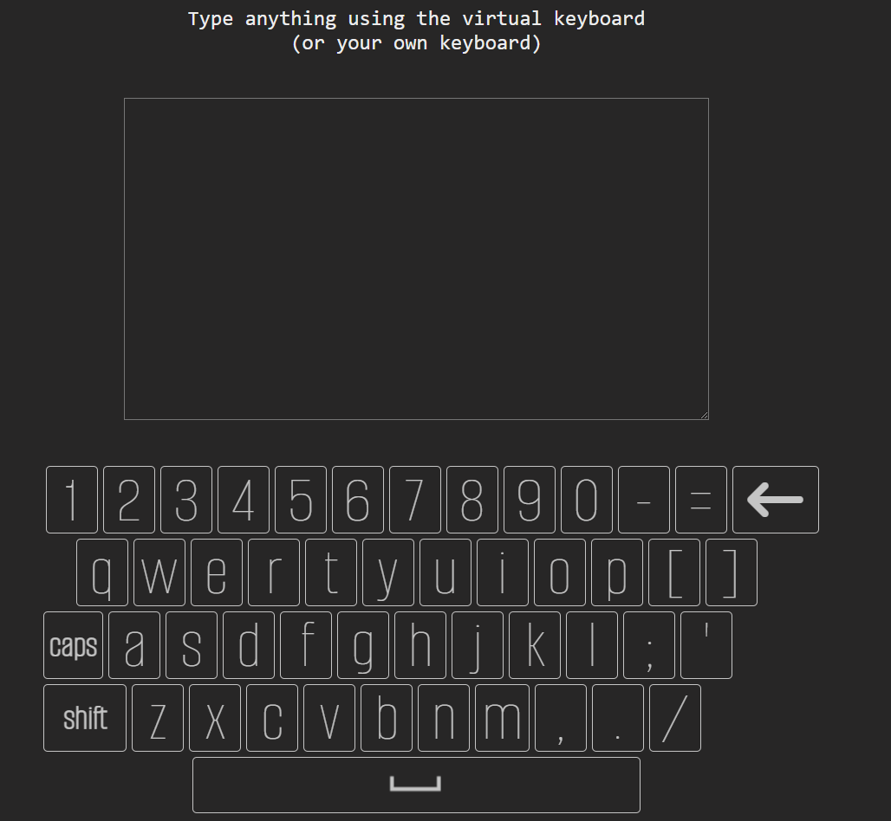

<h1 align="center">React.js Virtual Keyboard</h1>

  

    
     
     
    Application created, designed, and published by Ryan Reeves
     
    <a href="https://github.com/rreeves1996/virtual-keyboard/issues">Report Bug</a>
    ·
    <a href="https://github.com/rreeves1996/virtual-keyboard/features">Inquire About Features</a>
     
    <a href='https://rreeves-virtual-keyboard.herokuapp.com/'>Heroku Deployment</a>
  

## About

My version of a virtual keyboard using React. Besides the fact that I've wanted to create my own version of a virtual keyboard for awhile now, I thought it would be fun and good practice to create it using React.
My goals included:

- Utilize useState and useEffect for the core functionalities of the app
- Effective use components, create components with as much reusability as possible
- Interactive UI: I wanted the keys and anything else the user interacts with to feel "correct" and reactive. One of the biggest components (hah) of keyboards that we don't even realize is tactile feedback - I wanted to replicate this as much as possible without a physical keyboard
- Responsive design: Most importantly, the design needs to be responsive and catered to a mobile first layout. The majority of real-world applications of a virtual keyboard involve mobile functionality - without any mobile functionality/responsiveness, the app doesn't have many (if any) use cases.

<!-- ## Roadmap

- [ ] Optimize mobile layout as much as possible
  - [ ] Mobile specific animations for keys
  - [ ] Landscape and portrait keyboard
- [ ] Put keyboard in to its own component
- [ ] Put textarea in its own component with keyboard
- [ ] Tab key, enter key -->

## Refactor notes

Nearly four months after creating this app, and I decided to tackle a refactor. A lot of my code was messy, strange, hard to follow, and it was all written in JavaScript, not TypeScript. After spending the last four months learning more about React, TypeScript, and Front-End Development as a whole, I decided to refactor it, so I could actually be proud of it sitting in my portfolio vs. simply displaying how far I've come since I've created the app by comparing it with my recent works.

Here was my process:
- Step one - integrate TypeScript
- Step two - from large scope to small, get general idea if the ways I went about creating the program can work, or if I need to start from scratch in certain areas
- Step three - clean up keyboard arrays by putting the data in external json files
- Step four - clean up messy useEffects that I used to cheat formatting (originally, I wanted to keep the code clean, so I wanted to render the key keys by mapping through arrays of strings with the characters being the individual array items. However, this became a challenege when I wanted certain special keys on the same rows as these character maps. To workaround this, I previously had put in useEffects that would prepend/append the special keys on pageload - in my junior brain this was a good solution, as I could continue to use my maps. I overcame this "workaround" by simply using an index, and conditional rendering based on the index.)
- Step five - reorganize messy JSX by dividing components up more (i.e. components for every keyboard layout)
- Step six - clean up weird JSX inconsistencies/poor semantics

Overall, I'm happy with the refactor. A huge portion of my mistakes came from failing to understand commonpractices in React and in development, and after spending the last four months learning, I was able to correct those mistakes. The code is much easier to follow now, and I think for the most part accomplished its goals as well as I'd expect of it without building the application from scratch.

## Contact

Ryan Reeves - [https://www.linkedin.com/in/rreevesdev/](https://www.linkedin.com/in/rreevesdev/) - rreeves.dev@gmail.com

Project Link: [https://github.com/rreeves1996/virtual-keyboard](https://github.com/rreeves1996/virtual-keyboard)

(<a href="#readme-top">back to top</a>)

